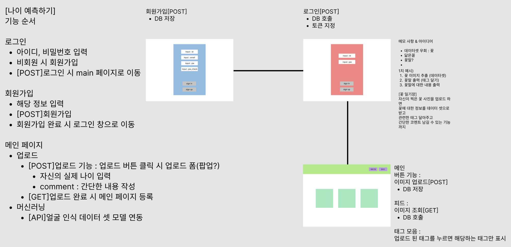

# :pushpin: HOW OLD ARE YOU ?
>자신의 얼굴 나이는 얼마나 될까, 궁금한 사람들을 위한 웹사이트  
>https://github.com/hangunhee94/object-detection-backend   

</br>

## 1. 제작 기간 & 참여 인원
- 2022.5.18 ~ 2022.5.25  
- 팀 프로젝트
- 4인  

### 🧙 맴버구성
- Backend - (깃헙 주소)
  - 공통 backend
    - 데이터 분석, AI 모델 개발

  - 엄관용(팀장) : frontend : CSS UI(후반작업) / backend : main
  - 나성근 : frontend : login 페이지 / backend : 머신러닝 데이터 분류, 코드단 세팅
  - 한건희 : frontend : signup 페이지 / backend : signup 
  - 이동현 : frontend : main 페이지 / backend : login
</br>

## 2. 사용 기술
#### `Back-end`
  - Flask

#### `Front-end`
  - HTML5
  - CSS3
  - JavaScript
  
</br>

## 3. 핵심 기능
>이 프로젝트의 핵심 기능은 머신러닝을 통한 얼굴이 보여지는 사진속 얼굴의 나이를 예측해주는 웹페이지입니다.   
>사용자는 각종 얼굴 사진을 등록하여 얼굴 나이를 예측 해볼 수 있습니다.      

### 3.1. 와이어프레임   
<p align='center'>
  
</p>


### 3.2. API    


<br>

## 4. 핵심 트러블 슈팅
### 4.1. Kakao Login 구현 시, 자동 회원가입 이슈

- Kakao Login 구현 도중 기존 Kakao 이메일로 접속을 하였을 때, 구현한 서비스의 로그인에 연동 실패

- DB에 Kakao 이메일에 대한 정보가 없기 때문에 발생하는 오류로 파악

- Kakao developer를 통해 받은 access_token 값을 이용하여 Kakaoprofile에서 email 과 id값을 받아와 
  if문을 통해 DB에 없는 email 이라면, 추가해주도록 설정
  ```
  def oauth():
    code = str(request.args.get('code'))
    # XXXXXXXXX 자리에 RESET API KEY값을 사용
    resToken = getAccessToken("XXXXXXXXXXXXXXXXX", str(code))
    print(resToken)
    profile = kakaoprofile(resToken['access_token'])

    print(profile['kakao_account']['email'])
    print(profile['id'])

    email = profile['kakao_account']['email']
    id = profile['id']

    user = db.member.find_one({'email': email})

    if user is None:
        db.member.insert_one({'email': email, 'id': id})

    result = db.member.find_one({
        "email": email,
        "id": id,
    })
    if result is None:
        return jsonify({'message': 'fail'}), 401
    payload = {
        'id': str(result['_id']),
        'exp': datetime.utcnow() + timedelta(seconds=60 * 60 * 24)  # 토큰 시간 적용
    }
    token = jwt.encode(payload, SECRET_KEY, algorithm='HS256')

    return jsonify({'message': 'success', 'token': token})
  ```
</br>

## 6. 회고 / 느낀점
>프로젝트 개발 회고 글: https://hee94.tistory.com/29 

---


### 📌 일정
5 / 18 기획 & 목업(S.A) / backend : 랜드마크 데이터 셋 모델 구현(필수), DB api 설계 / frontend : 로그인, 회원가입 폼 구현(추가)  
5 / 19 S.A 피드백 / 1차 backend : 랜드마크 모델 api 구현, 머신러닝 api 이미지 업로드 연동,   / frontend : 이미지 업로드 기능 구현  
5 / 20 2차 backend : 랜드마크 모델 api 구현, 머신러닝 api 이미지 업로드 연동,   / frontend : 이미지 업로드 기능 구현  
5 / 21 1, 2차에 대한 보충  
5 / 22 1, 2차에 대한 보충  
5 / 23 1차 마감(병합), 코드리뷰  
5 / 24 GIT 정리 & 발표 영상 녹화 & 제출 (오후 5시)  

#### 데이터 학습 결과 표(https://docs.google.com/spreadsheets/d/1hg_YwVelVWKVhCj8pfvkhSnO_PIEEOwVqgbXlPY7yyA/edit#gid=0)
