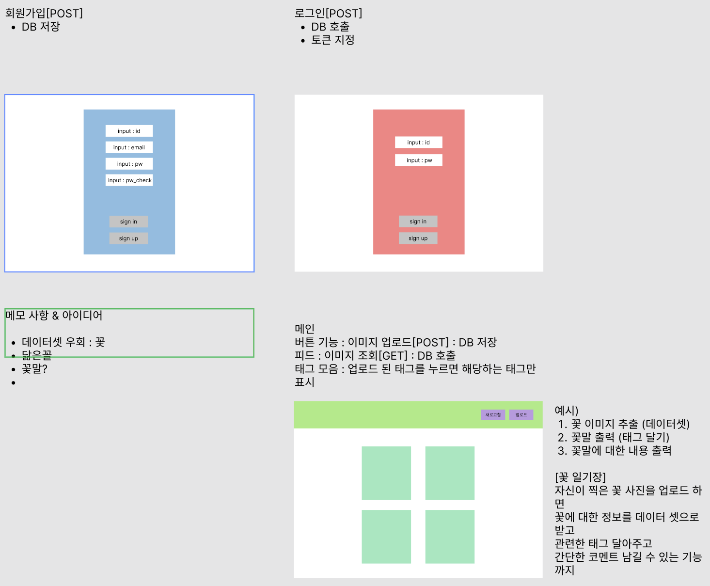

## ladder team S.A(Starting Assignment)

<!--  팀 이미지  -->

### 🔗 시연 영상
url 

### 🏠 소개
랜드마크 위치 검색

### ⏲️ 개발기간
2022년 05월 18일 ~ 2021년 05월 25일

### 🧙 맴버구성
- :Frontend
  - 
- :Backend - (https://github.com/eungenie/SpringBoot-Project-Triport)
  - 엄관용, 나성근, 한건희, 이동현

<!-- ### 📌 기술 선택 이유! - <a href="https://github.com/rayrayj92/triport/wiki/%EA%B8%B0%EC%88%A0-%EC%84%A0%ED%83%9D-%EC%9D%B4%EC%9C%A0" >상세보기 - WIKI 이동</a> -->

### 📌 필수 기능
- [ ] 사물인식 기능
- [ ] 업로드 이미지 해당 카테고리 출력 서비스 ((ex. 강아지 사진을 업로드 하면 품종을 인식해서 태그를 달아주거나 맛집 탐방후 음식 인식해서 태그를 달아 주는기능 등)
- [ ] 이미지마다 인식한 사물의 정보를 로그에 저장해주세요 <질문사항>

### 📌 추가 기능
- [ ] 커스텀 데이터셋을 만들어서 학습
- [ ] 브라우저의 웹캠 기능 사용으로 촬영 혹은 실시간으로 사물인식
- [ ] 결과 공유 기능
- [ ] 회원기능
    - 소셜 로그인(구글, 카카오) 기능

### 📌 도전 과제
- [ ] GIT의 Pull Request를 요청시 팀원 중 한 명 이상이 코드를 검토후 코멘트를 달아주세요. 리뷰가 끝나면 Merge를 진행해주세요.
- [ ] 프론트엔드와 백엔드를 별도의 레포지토리로 분리해서 사용해주세요. (flask에서는 `render_template` 을 사용하지 않고 json 데이터만 보내주는 방식)
- [ ] 백엔드 개발에 Postman을 적극 활용해주세요
- [ ] jQuery대신 javascript를 이용해서 프론트엔드를 작성해주세요.
- [ ] Flask 블루프린트를 사용해서 API 모듈화

### 📌 와이어 프레임

  
1차 와이어 프레임

  

### 📌 일정
5 / 18 기획 & 목업(S.A) / backend : 랜드마크 데이터 셋 모델 구현(필수), DB api 설계 / frontend : 로그인, 회원가입 폼 구현(추가)  
5 / 19 S.A 피드백 / 1차 backend : 랜드마크 모델 api 구현, 머신러닝 api 이미지 업로드 연동,   / frontend : 이미지 업로드 기능 구현  
5 / 20 2차 backend : 랜드마크 모델 api 구현, 머신러닝 api 이미지 업로드 연동,   / frontend : 이미지 업로드 기능 구현  
5 / 21 1, 2차에 대한 보충  
5 / 22 1, 2차에 대한 보충  
5 / 23 1차 마감(병합), 코드리뷰  
5 / 24 GIT 정리 & 발표 영상 녹화 & 제출 (오후 5시)  

